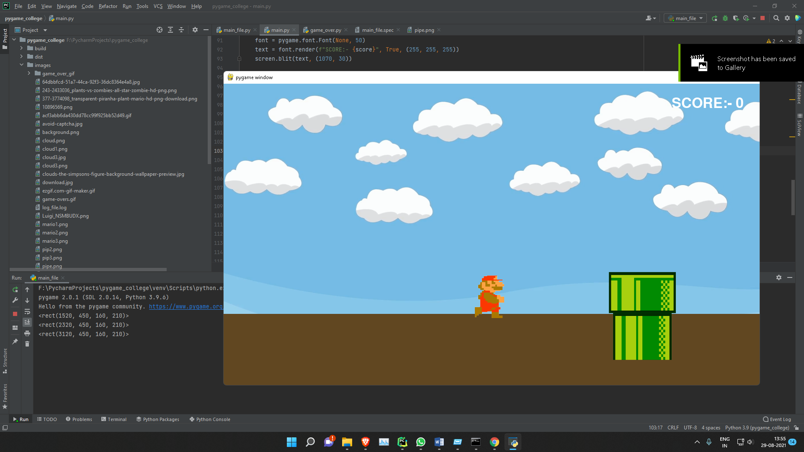

# **Mario Runner**

This game was developed for college project, this uses the pygame module generally to display and play sound effects.

### How to Run:-

1. Install python and pip
2. run `pip install -r requirements.txt`
3. `python main_file.py`

Video:-

https://www.loom.com/share/e002255e1a6542b6a91532e5ee860369

Screenshots:-

